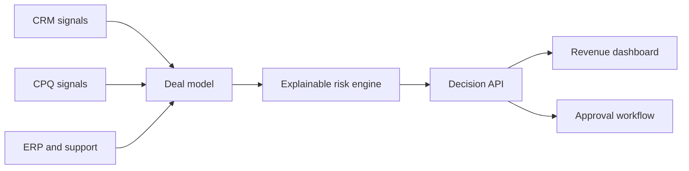

# Sauda — Explainable Deal Intelligence

Sauda turns fragmented CRM, CPQ, ERP, and customer-health signals into an explainable deal-risk score and an approval recommendation. It helps revenue teams see *why* a deal may stall before approving discount, margin, or payment-term exceptions.

> This public repository is a standalone portfolio implementation inspired by my winning NYU × Salesforce case competition project. It uses synthetic data and contains no Salesforce, employer, client, or UN proprietary code or information.

## Why this project

Revenue teams often review commercial context across several systems. Sauda demonstrates a unified decision layer that:

- consolidates deal and account signals into one API;
- produces deterministic, auditable risk explanations;
- separates commercial risk from approval-policy thresholds;
- routes high-value, low-margin, or deeply discounted deals for review; and
- provides an accessible decision dashboard for sales and finance partners.

## Demo

The included dashboard loads five synthetic deals and lets you inspect each assessment. Swagger API documentation is automatically available at `/docs`.

## Architecture



The current implementation uses local synthetic JSON as a clean adapter boundary. In production, the same `Deal` contract can be populated by Salesforce, CPQ, ERP, and customer-success connectors.

## Tech stack

- Python 3.12, FastAPI, Pydantic
- HTML, CSS, and vanilla JavaScript
- Pytest and FastAPI TestClient
- Docker and GitHub Actions

## Run locally

```bash
python -m venv .venv
source .venv/bin/activate
pip install -r requirements.txt
uvicorn app.main:app --reload
```

Open `http://127.0.0.1:8000`. API docs: `http://127.0.0.1:8000/docs`.

Or run with Docker:

```bash
docker build -t sauda .
docker run -p 8000:8000 sauda
```

## API

| Method | Endpoint | Purpose |
| --- | --- | --- |
| `GET` | `/health` | Service health check |
| `GET` | `/api/deals` | All deals with assessments |
| `GET` | `/api/deals/{deal_id}` | One deal and its assessment |
| `POST` | `/api/assess` | Assess any valid deal payload |

## Decision logic

Every risk factor includes a code, label, point impact, and evidence string. The engine caps risk at 100 and maps it to low, medium, or high. Approval routing is intentionally separate: a large but healthy deal may require authorization without being mislabeled as risky.

This rule-based baseline prioritizes auditability. A future ML layer could estimate win probability or detect anomalies, while retaining this policy layer for governance and human review.

## Test

```bash
pytest -q
```

Tests cover risk scoring, score caps, approval routing, API health, response shape, and error handling. CI runs the suite on every push and pull request.

## Roadmap

- PostgreSQL persistence and event history
- OAuth and role-based approval permissions
- Salesforce webhook adapter
- What-if simulator for discount and payment terms
- Model monitoring for a learned probability layer

## Project context

The original April 2026 NYU project explored an agentic decision-intelligence concept spanning CRM, CPQ, and ERP context, explainability, governance, and in-flow approvals. Its reported impact figures were case-study projections, not production measurements. This repository rebuilds the underlying product idea as an independently runnable technical demonstration.

## Author

**Aditi Jha** — AI/product builder and former software engineer, M.S. Management of Technology, NYU Tandon.

## License

MIT
